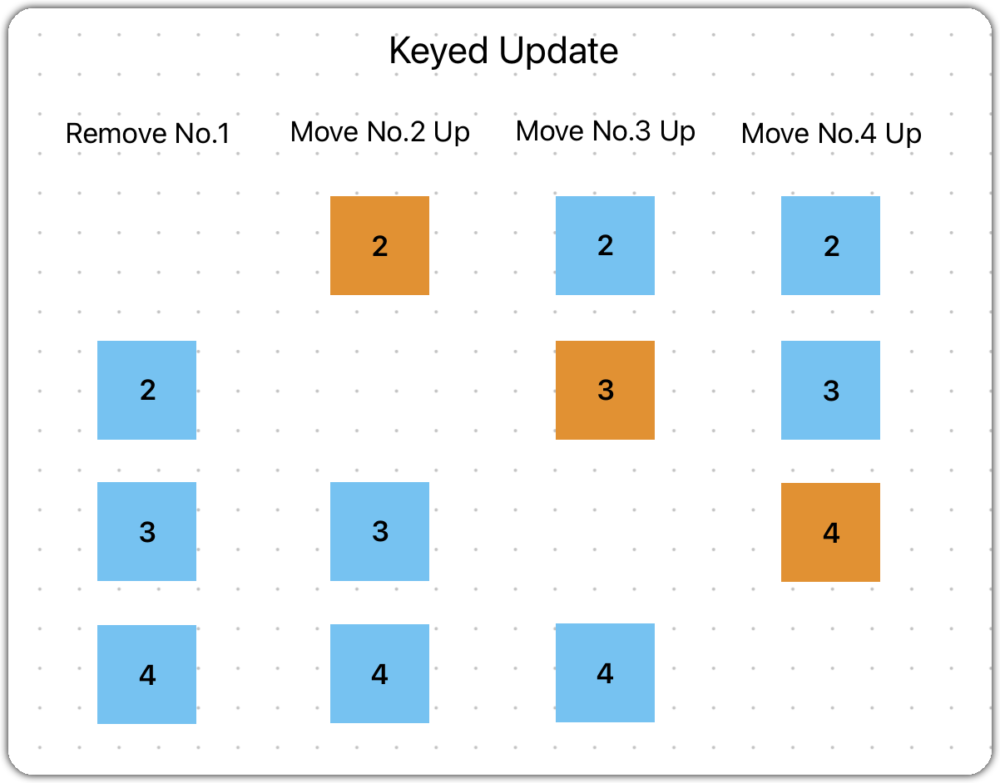
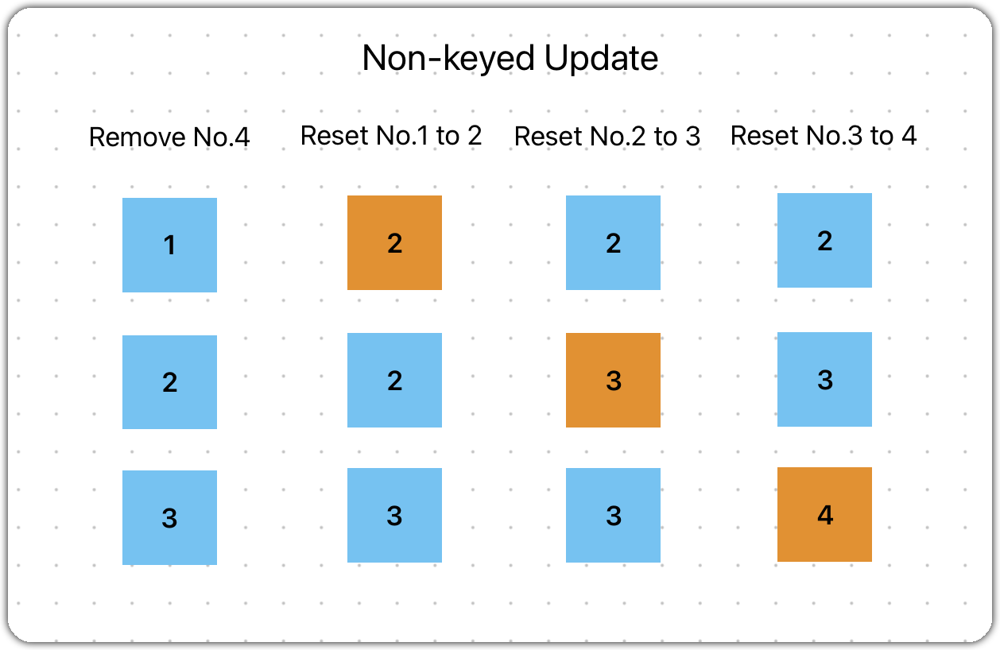

Most modern frameworks have introduced their custom methods or syntax to handle loops as they do in conditional rendering. Let's also take a took at the components party's given examples for those different frameworks:

```js [react]
return (
  <ul>
    {colors.map((color) => (
      <li key={color}>{color}</li>
    ))}
  </ul>
)
```

```html [vue]
<template>
  <ul>
    <li
      v-for="color in colors"
      :key="color"
    >
      {{ color }}
    </li>
  </ul>
</template>
```

```js [solid]
return (
  <ul>
    <For each={colors}>{(color) => <li>{color}</li>}</For>
  </ul>
)
```

```html [svelte]
<ul>
  {#each colors as color (color)}
    <li>{color}</li>
  {/each}
</ul>
```

While these frameworks provide their unique ways to loop through items, they introduce an additional layer of syntax, which can sometimes lead to confusion, especially for developers transitioning between different frameworks. In contrast, DLight stays true to JavaScript's essence:

```js [dlight]
ui(); {
  for (const color of colors) {
    li(color)
  }
}
```

With DLight, what you see is the raw and familiar power of JavaScript.

# Keyed vs. non-keyed
Keyed update uses a unique identifier (a "key") for each item. This key helps in tracking the identity of each item through re-renders. When data changes, only the specific items that changed (based on the unique key) are updated.

DLight accepts all types of keys. By default, the item inside a loop itself is the key:
```js
for (const color of colors) {
  li(color)
}
// -> key = color
```
And you can set your own specific key by adding a one-length array that contains your key right after the for body:
```js
for (const [idx, color] of Object.entries(colors)) { 
  [myId]
  li(color)
}
// -> key = idx
```
Contrary to react, a non-keyed loop is always faster than a keyed one in DLight. Here's a simple example that explains why this is the case. Imagine we have four elements displaying number `1, 2, 3, 4`, and we want to remove number 1.

For keyed-update, it'll need to first remove number 1 and move other three elements up. In this case, we need to calculate the removed element idx and removed it from its parent node.

For non-keyed-update, it'll just delete the last element and change the front elements accordingly. In implementation, we don't need to find the idx of the element to be removed. What we do here is to get the new array length(3) and cut there in our old array(1,3,4), then we do some element property altering operations, which are much cheaper.


Non-keyed update works for 90% scenarios if there's no specific requirement to set a key. And this is how we do it in DLight:
```js
for (const color of colors) { 
  [null]
  li(color)
} 
// -> non-keyed loop
```
