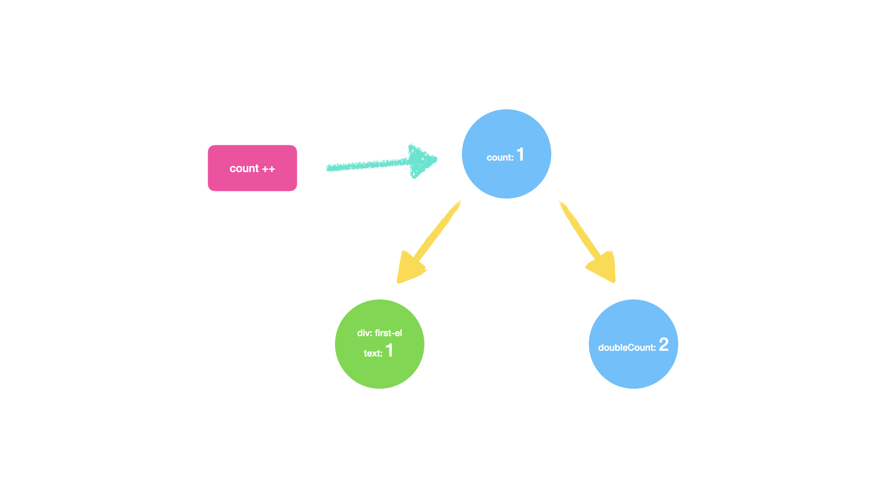
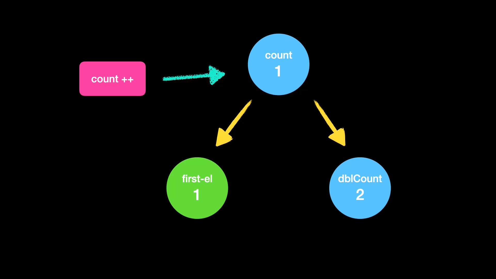
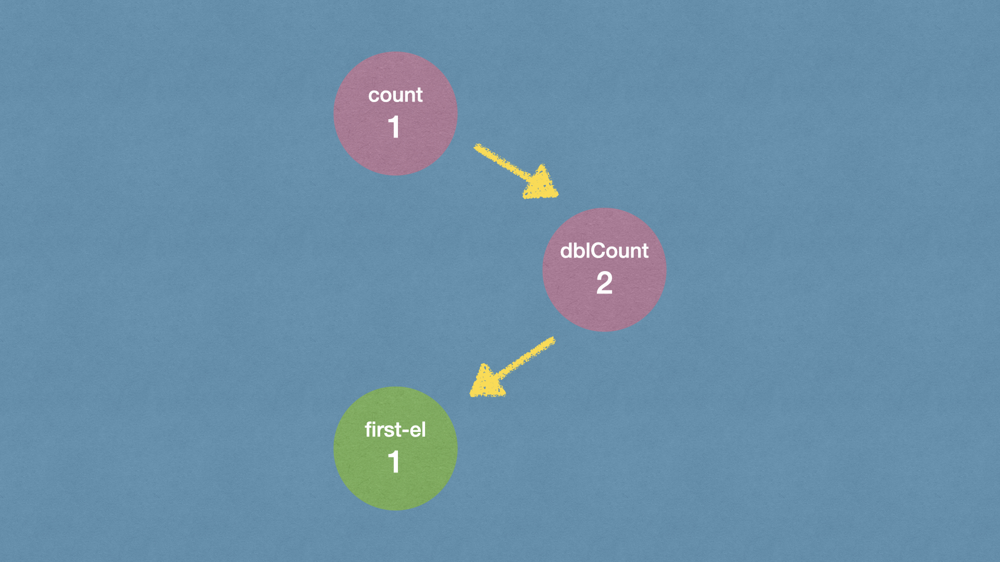
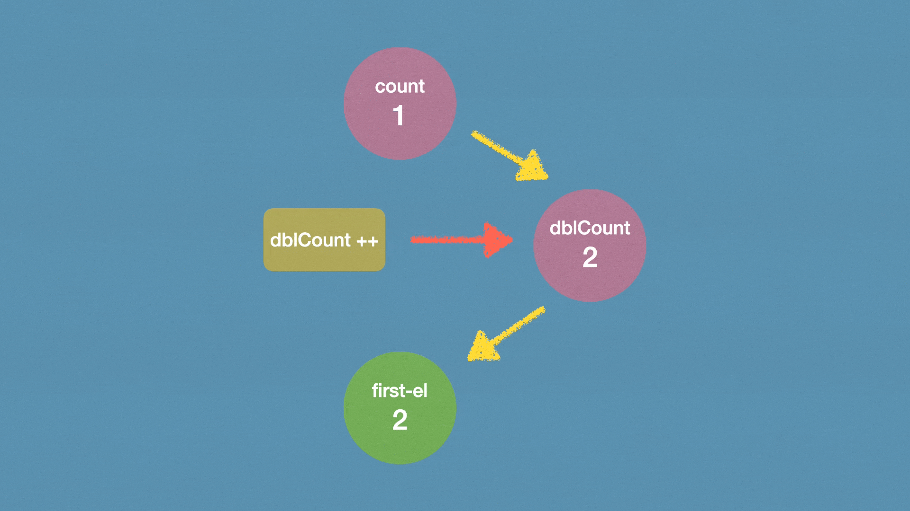
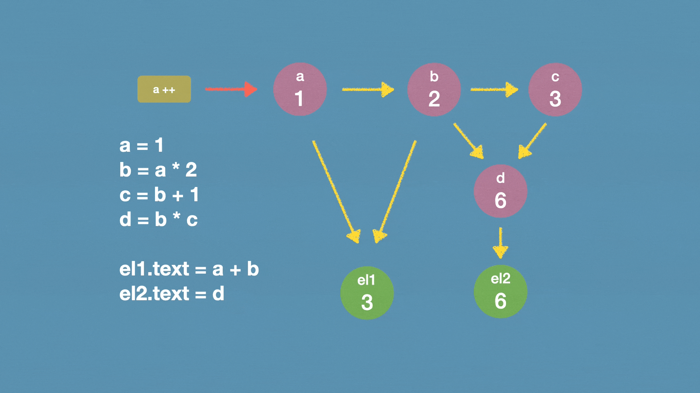
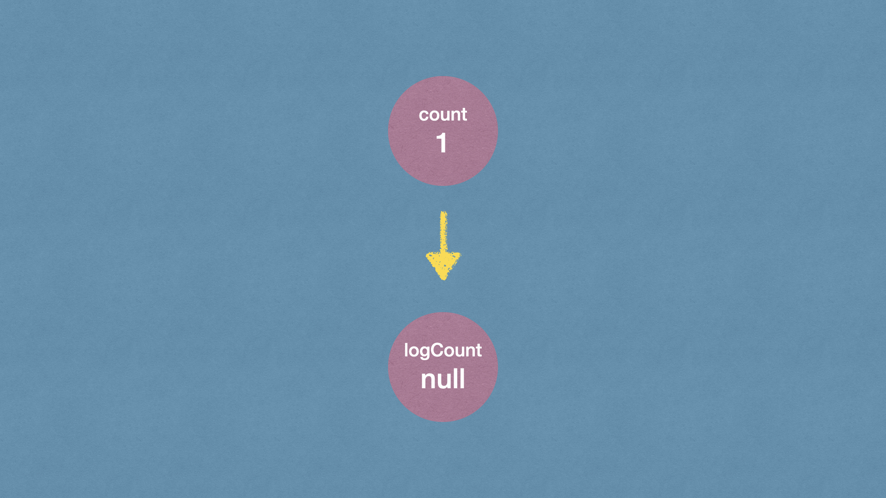
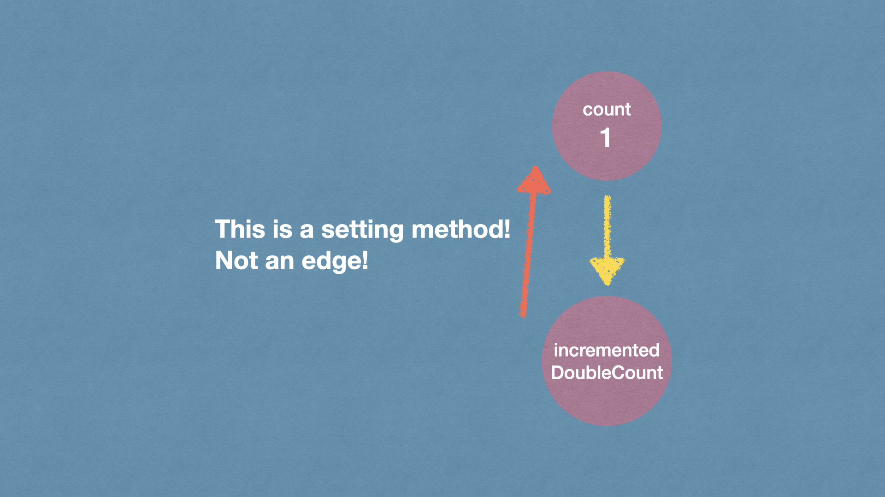
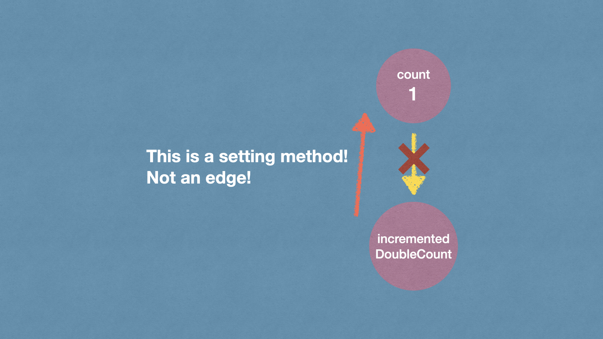

A Deep Dive into the Reactivity Graph

# Introduction
Reactivity, or the ability to update the UI in response to data changes, is pivotal in modern frontend frameworks. As frontend applications burgeon in complexity, managing the mutable states and their effects on the UI is vitally important. While the frontend community has devised various solutions for reactivity, a handful of common issues and challenges still linger:
* Inconsistent Updates: Issues can sprout from inconsistencies between data changes and UI updates.
* Over-rendering: An inability to precisely discern which UI parts need re-rendering can lead to unnecessary computations and DOM manipulations.
* Dependency Management Challenges: Understanding and managing dependencies between various states becomes increasingly intricate in large applications.
* Debugging Difficulties: Without clear data flow and update logic, troubleshooting can become a notably time-consuming task.


# Concept of Reactivity Graph
Reflecting on these challenges, can we discern a pattern? Don’t these updates, dependencies, and data movements construct a graph? The data states serve as nodes and their dependencies as edges, weaving a network wherein changes propagate to trigger UI updates when data alters.

This brings us to the crux of today's discussion — the “Reactivity Graph”. The Reactivity Graph is a directed acyclic graph and within this graphical model:
* Nodes: Represent an observable and mutable state.
* Edges: Depict dependencies between states.
* Direction: Determines the propagation direction of data changes.

Each state change in this model will propagate along the direction of the dependencies (edges), accurately updating all affected parts in the application and minimizing unnecessary renders and calculations.

While the concept of the `Reactivity Graph` has been explored and applied in various domains since the last century, its thorough and systematic implementation in frontend frameworks is notably lacking. This gap presents an opportunity to explore and adapt this robust model to address the unique challenges of managing reactivity and data flow in modern web development.

# Building Reactivity Graph
## Basic count example
Consider a simple application state where we have `count`, `doubleCount` (which is always twice the count), and a UI element `first-el` that displays the count value.

Before we visualize our Reactivity Graph, let’s take a moment to conceptualize our example through code. Note that the following syntax ISN'T specific to any framework but is written to convey the idea in an understandable manner.
```js
let count = declareState(1);
let doubleCount = declareState(count * 2);
const el1 = document.createElement("div");
el1.id = "first-el";
el1.innerText = declareState(count)
```
Here's a simplified breakdown:
* `declareState(0)`: Declares a reactive state count initialized with 0.
* `declareState(() => count * 2)`: Declares a reactive derived state doubleCount that is always double the value of count.
* `document.createElement("div")`: Creates a new `<div>` element and assigns it an ID of "first-el".
* `bindView(el, "innerText", () => count)`: Binds the inner text of our el element to always display the current value of count.

Now, let's transform this into a simple reactivity graph:


In this graph, nodes (`count`, `doubleCount`, and `div: first-el`) represent our states and UI element and edges signify the dependencies between them, which will be:
1. When `count` changes, `doubleCount` re-calculates **ONCE** 
2. When `count` changes, `first-el` re-renders innerText **ONCE**
Put them in a table:

| state | target |
| --- | --- |
| count | doubleCount |
|       | first-el |

Visualizing will be like:



## Adding a Layer of Complexity
Let’s modify our example to make `first-el` display `doubleCount` instead of `count`. We'll also need to make some small changes to the JavaScript pseudo-code to reflect this:
```jsx
let count = declareState(1);
let doubleCount = declareState(count * 2);
let el1 = document.createElement("div");
el1.id = "first-el";
el1.innerText = declareState(doubleCount)
```
The reactivity graph would look like:



Here's an illustration of the reactivity flow within our new graph:
1. When `count` changes, `doubleCount` re-calculates **ONCE** 
2. When `doubleCount` changes, `first-el` re-renders innerText **ONCE**

And here's the table version:
| state | target |
| --- | --- |
| count | doubleCount |
| doubleCount | first-el |

Animated version:


A noteworthy point of discussion here is the direct alteration of derived states, such as `doubleCount` in our example.

Under conventional logic, direct modification of doubleCount may be seen as a no-op since it’s computationally bound to `count` (specifically `count * 2`). However, a paradigm shift in thinking allows us to ponder: why should `doubleCount` be immutable? After all, it's a variable, and variables, by nature, are mutable.

Let's assume we adjust `doubleCount` directly like `doubleCount ++`. In a reactivity graph that supports mutable derived states, the following sequence would unfold:
1. `doubleCount` increments by 1 and thus, its new value is 3.
2. The change in `doubleCount` triggers `first-el` to re-render, updating its displayed value to 3.

Under this model, any subsequent alteration to count will yet again recalculate `doubleCount` and induce a fresh re-render of `first-el` with the new value. So if we do `count++`:
1. `count` increments by 1, and its new value becomes 2.
2. `doubleCount` re-calculates, adhering to its defined logic `count * 2`, and updates its value to 4.
3. The change in `doubleCount` prompts `first-el` to re-render, displaying the new value, 4.





## Section Wrap-up and More Complexity
In the previous part, we've built some simple reactivity graphs, understanding how various states and their dependencies can be visualized and managed using this model. From simple to complex dependencies, the reactivity graph has demonstrated its ability to intuitively illustrate and guide state management and data flow within applications.

Let’s get a more complicated example, with multiple states and dependencies in a mathematical logic operation setting.

Imagine we have four states: a, b, c, d:
* a: Base state, initial value 1.
* b: Depends on `a` as `a * 2`.
* c: Depends on `b` as `b + 1`.
* d: Depends on `b` and `c` as `b * c`.

and two elements:
* el1 => display `a + b`
* el2 => display `d`

No we can get the reactivity graph:



# Adapting Reactivity Graph to Frontend
The adaptation of the reactivity graph in frontend development introduces a variety of scenarios that may require specific handling or modifications of the graph to ensure smooth and efficient reactivity management.

We've mentioned four frontend challenges with reactivity graph before, which are:
* Inconsistent Updates
* Over-rendering
* Dependency Management Challenges
* Debugging Difficulties

In this section, we'll go deeper into strategizing the reactivity graph model to navigate through complex frontend scenarios and deliver optimal user experiences.

## Inconsistent Updates
Inconsistent updates refer to the scenario where the UI does not accurately reflect the current application state, causing discrepancies and potentially leading to incorrect data being displayed or processed.

By adhering to the flow of the reactivity graph, the execution becomes inherently robust, safeguarding against inconsistencies in UI updates.

And there's a big part of the updating scenario to be this "side effects" situation. In current frontend frameworks, developers often contend with "side effects," which refer to operations that influence or are influenced by states outside their local environment. These might encompass data fetching, subscriptions, or manual DOM manipulations. Essentially, they are operations that not only derive new data from existing values but also initiate changes that might indirectly affect other parts of the system. The introduction of side effects often complicates the data flow, occasionally leading to the dreaded inconsistent updates, where the UI does not accurately mirror the prevailing application state.
 
In contrast, the reactivity graph methodically extinguishes the concept of side effects, adopting a structure where:
* Every operation, state, or view is encapsulated as a node.
* All influences and dependencies are transparently depicted as edges.

Let’s illustrate this with a concrete example to provide a better understanding.

In conventional front-end frameworks, developers might utilize side effects to, say, log the current state of a variable to the console whenever it alters. Note that the following syntax ISN'T specific to any framework but is written to convey the idea in an understandable manner.
```js
const [count, setCount] = state(0)

effect(() => {
  console.log(count);
}, [count])
```
In this scenario, `effect` operates as a side effect that listens for changes in count and runs a block of code (logging to the console) whenever count alters.

Doing this in a reactivity graph, the traditionally known side effect is essentially translated into a dependent node within the graph structure. Let’s further this with a pseudo-coding approach:
```js
let count = declareState(1)
let logCount = declareState((() => {
    console.log(count);
    return count; // This value can be anything, as the main purpose is the execution of the IIFE.
})());
```
Here:
* `declareState(0)`: Declares a reactive state count, initialized with 0.
* `declareEffect(() => console.log(count))`: This isn't setting up a "side effect" in the traditional sense. Instead, it establishes another state. However, because it's an immediately-invoked function expression (IIFE), it executes the logging operation instantly during its declaration. The act of logging here, similar to a "side effect", is performed before a value is returned and the state is finalized. However, within the context of a reactivity graph, this is not viewed or treated as a "side effect" but merely a state with an operation executed during its creation.

In the reactivity graph, it would be visualized as:


In the reactivity graph, everything, including what traditional frameworks might regard as side effects, is treated as nodes. This means there's no explicit "effect" or "side effect" concept; every node has equal footing, and the behavior is based on the relationships (edges) they form with other nodes. This design choice simplifies dependency management, and with every operation being explicit and contained within nodes, there is clarity in data flow and less room for inconsistencies.

## Over-rendering
Over-rendering is one of the most prevalent performance concerns in frontend development. It occurs when parts of the UI are re-rendered without any actual change in the data they represent, leading to unnecessary computational overhead.

The reactivity graph, with its explicit depiction of nodes (states and views) and edges (dependencies), provides a robust countermeasure against over-rendering. Here's how:
1. Explicit Dependency Management: With each node's dependencies clearly marked by edges, there's a lucid picture of what data impacts which part of the UI. This structure ensures that only the affected parts of the UI get re-rendered when a particular data node changes.
2. Optimized Change Propagation: The graph-based model promotes an efficient traversal method. When a node updates, only its direct and indirect dependencies are re-evaluated, sidestepping any unrelated computations.
3. Granular Control over Properties: Developers can exercise finer control by designating specific properties of a view as individual nodes. By doing so, only these properties get updated, negating the need to re-render the entire component. This granularity prevents the waste of resources and significantly boosts performance.

## Dependency Management Challenges
Loop dependencies arise when there's a direct or indirect self-reference causing a reactive state or operation to endlessly trigger itself. Such dependencies can lead to infinite loops, making the application unresponsive or producing unintended results.

In a typical reactive system, this can cause severe issues. However, the reactivity graph is equipped to detect and handle these scenarios more efficiently.

Consider the following pseudo-code example:
```js
let count = declareState(2 / reverseDouble);
let incrementedDoubleCount = declareState((() => {
  count ++
  return count * 2
})());
```
In this case:
* The `incrementedDoubleCount` operation increments count and return its doubled value.
* When `incrementedDoubleCount` is evaluated, it changes count, which in turn changes `incrementedDoubleCount` it self, affecting the value of count again and again and again, which causes a loop dependency.

Reactivity Graph's approach to loop dependency can be descripted as follows:
1. Identification of Loop Point: The reactivity graph identifies potential loop points by locating state nodes that contain both getter (dependencies) and setter (assign) methods.
2. Segmentation into AssignDeps: Once a loop point is detected, all setter methods within the state are isolated and categorized as assignDeps.
3. Filtering Dependencies: The next step involves filtering the dependencies of the node. The updated set of dependencies (deps) for the node becomes:
```text
resolvedDeps = { x | x ∈ deps & x ∉ assignDeps }
```
By using this formula, the reactive system ensures that all setter methods' dependencies (which can potentially introduce loops) are removed from the reactive dependencies of the state.

We can illustrate this approach with:




It's worth noting that loop dependencies are different from circular dependencies. Circular dependencies mean that A depends on B and B depends on A at the same time, which will never happen since:
1. By design, the reactivity graph is a Directed Acyclic Graph (DAG), which means it inherently lacks cycles.
2. In JavaScript, variables must be declared before being referenced.

By using the above steps, the reactivity graph ensures that loop dependencies are effectively handled, preventing infinite loops and ensuring smooth application behavior. 


## Debugging Difficulties
Debugging is a critical aspect of software development, and in complex reactive systems, it can be particularly challenging. One of the main hurdles often faced is the obscurity of data flow, making it tough to pinpoint where things might have gone awry.

However, the reactivity graph provides a solution to this conundrum. Its clear, node-based structure allows for a transparent view of the entire state flow. With this clarity, developers can easily trace the origin of any inconsistencies or unexpected behaviors.

In essence, the reactivity graph simplifies debugging by offering a coherent and lucid overview of the state interactions and dependencies. As a result, developers can swiftly identify and resolve issues, ensuring the smooth operation of the application.

# Summary
In this article, we delved deep into the concept of "Reactivity Graph" and showcased how it can be used to address reactivity issues in frontend applications.

Key Takeaways:
* Concept of Reactivity Graph: A reactivity graph is a directed acyclic graph where nodes represent observable and mutable states, and edges signify the dependencies between states. Through this, any change in data can be propagated accurately, leading to efficient UI updates.
* Challenges in Frontend Development: We outlined four main reactivity challenges faced in frontend development - inconsistent updates, over-rendering, challenges in dependency management, and difficulties in debugging. The reactivity graph offers a structured approach to tackle these issues.

In conclusion, the reactivity graph provides frontend developers with a potent tool to more effectively manage application state and UI changes. By utilizing this approach, developers can build more robust, efficient, and maintainable applications. And as frontend technology continues to advance, we look forward to seeing more innovations and optimizations that make reactivity management even simpler and more efficient.
