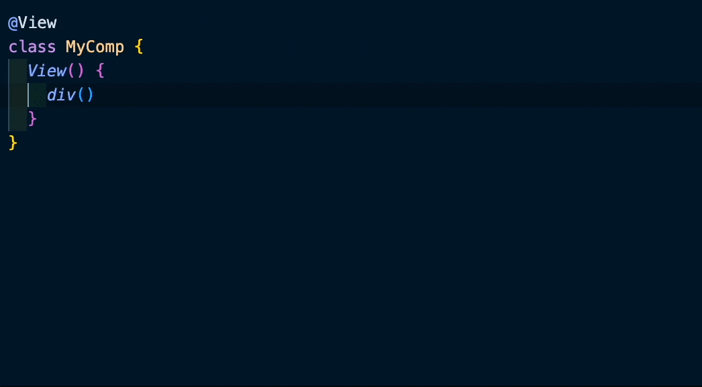
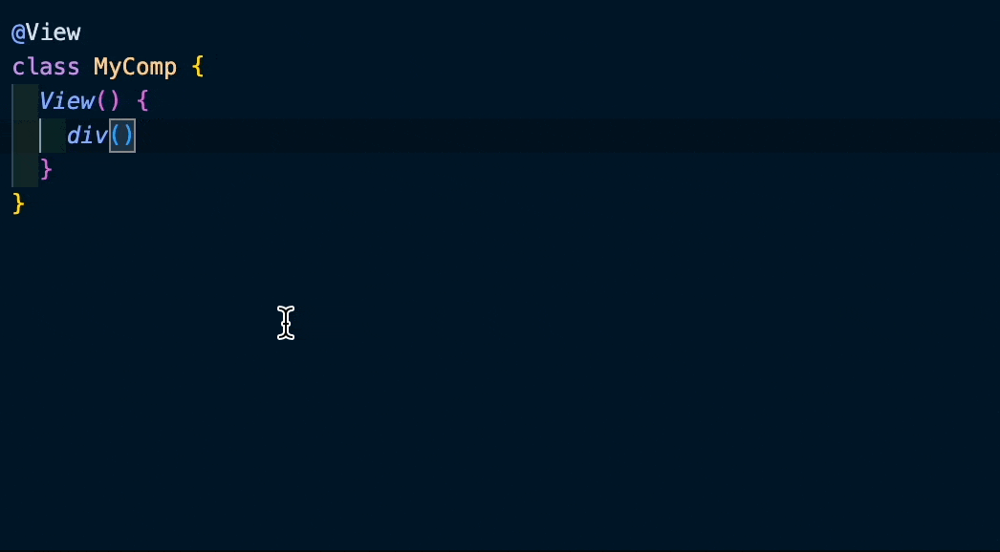
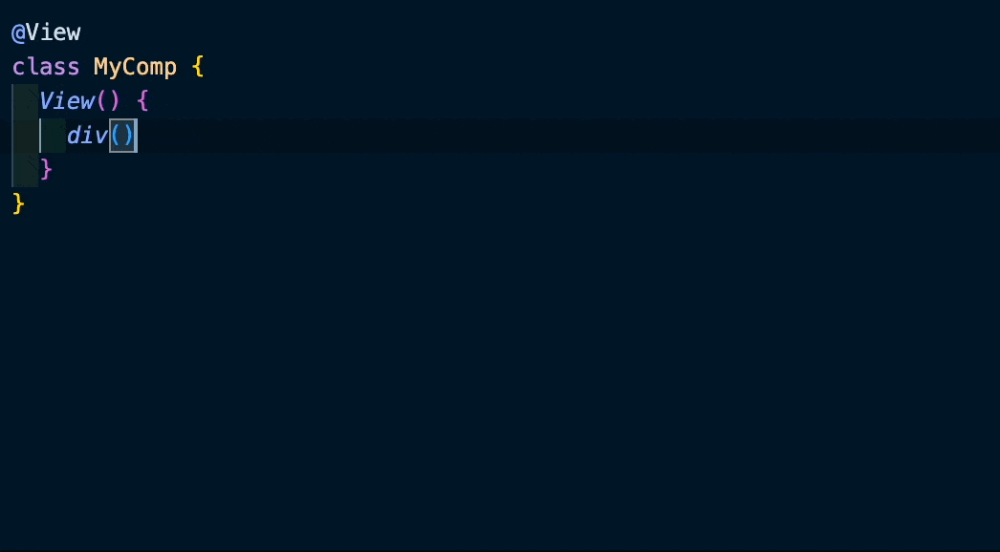
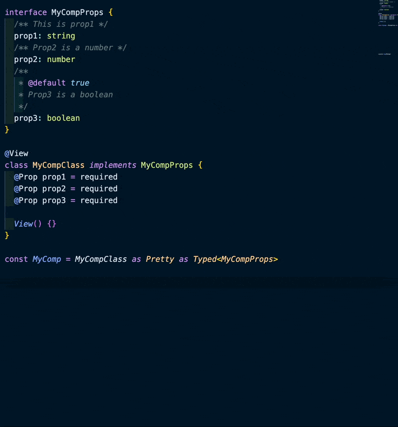
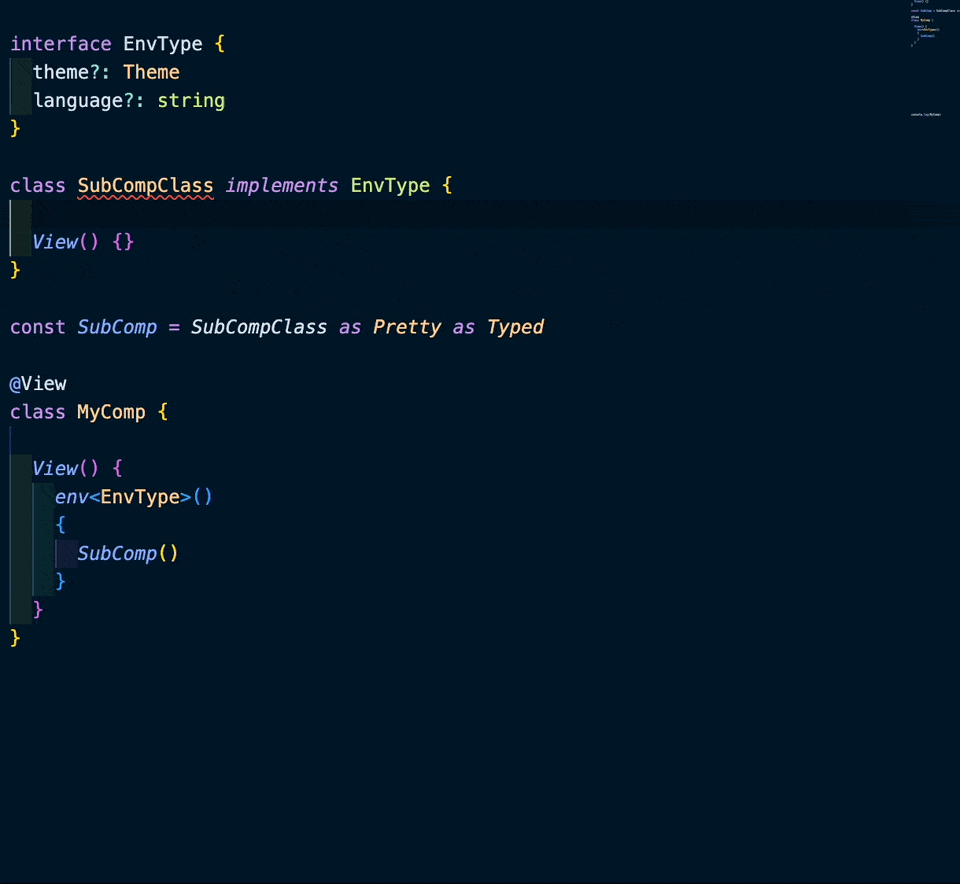

We've got PURE JS POWER in DLight's View syntax. We want the same thing for the typing support of TypeScript, which means no plugins, no extra vscode extensions, and no extra configuration. We want to use ts's buildin typing support to make developing experience smooth and delightful. 

This integration is provided by the `@dlightjs/types` package. It provides a set of typescript types for DLight's DSL syntax. You should install it as a `devDependency` instead of a `dependency` because it's only used for typing support(even though you may see some value references in your code, but they'll all be removed by the DLight compiler).

# HTML Elements
Example first:
```typescript
import { View, div, button } from "@dlightjs/dlight"

@View
class MyComp {
  Body() {
    div().class("app"); {
      button("click me")
        .onClick(() => {
          alert("clicked")
        })
    }
  }
}
```

No difference from the js version. But after you add imports from `@dlightjs/types`, you'll get full typing support in your IDE:

Attributes & events:


Inline style & dataset:


Lifecycle & element:



# Components
Also example first:

```typescript
import { View, required, type Typed, type Pretty } from "@dlightjs/dlight"

interface MyCompProps {
  /** This is prop1 */
  prop1: string
  /** Prop2 is a number */
  prop2: number
  /**
   * @default true
   * Prop3 is a boolean
   */
  prop3: boolean
}

@View
class MyComp implements MyCompProps {
  @Prop prop1 = required
  @Prop prop2 = required
  @Prop prop3 = required

  Body() {}
}

export default MyComp as Pretty as Typed<MyCompProps>
```

So to get full typing support for your component, you need to:
1. Declare a type for your component props as you always do in ts
2. Implement the type in your component class
3. Cast component first to `Pretty` and then to `Typed` with the type you declared in step 1

The reason that we need to cast the component to `Pretty` first is that we need to force cast a class type to a function, and `Pretty` is just an alias of `any`. So basically, we're doing this:
```typescript
export default MyComp as any as Typed<MyCompProps>
```

But this would be too ugly and became **AnyScript**, so we do `as Pretty as` to make our code `as Pretty as` the type we defined.


And what you get in your IDE:



# Environment
Example:
```typescript

interface EnvType {
  theme?: Theme
  language?: string
}

@View
class SubCompClass implements EnvType {
  @Env theme?: Theme | undefined
  @Env language?: string | undefined
  Body() {}
}

const SubComp = SubCompClass as Pretty as Typed

@View
class MyComp {

  Body() {
    env<EnvType>()
      .language("en")
      .theme(darkTheme)
    {
      SubComp()
    }
  }
}
```
What you get in your IDE:


# Modeling
Example:
```typescript
import { Model, type Modeling, type Pretty } from "@dlightjs/dlight"

interface FetchModelProps {
  url: string
}

@Model
class FetchModel implements FetchModelProps {
  @Prop url = required
  data = await fetch(this.url)
}

export default FetchModel as Pretty as Modeling<FetchModel, FetchModelProps>
```

DLight offers a type to get best coding experience with `use` function in TypeScript. The first type parameter is the model class, and the second type parameter is the props interface.

## Generic Modeling
```typescript
import { Model, type Modeling, type Pretty } from "@dlightjs/dlight"

interface FetchModelProps<G> {
  url: string
  args: G
}

@Model
class FetchModel<T, G> implements FetchModelProps<G> {
  @Prop url = required
  @Prop args = required
  data: T = await fetch(this.url, this.args)
}

export default FetchModel as Pretty as <T, G>(props: G) => GetData<T, G>
```

When you want to make a generic model, things get a little bit tricky. You need to declare the generic type in the model class and the props interface, and then you need to declare a function type with generic type parameters to cast the model class to it. So that when you use it in `use` function, you can do it like:
```typescript
const fetchModel = use(FetchModel<string, MyDataType>, { url, args })
```

You won't be seeing this a lot unless you're doing some advanced stuff or you're a lib builder.